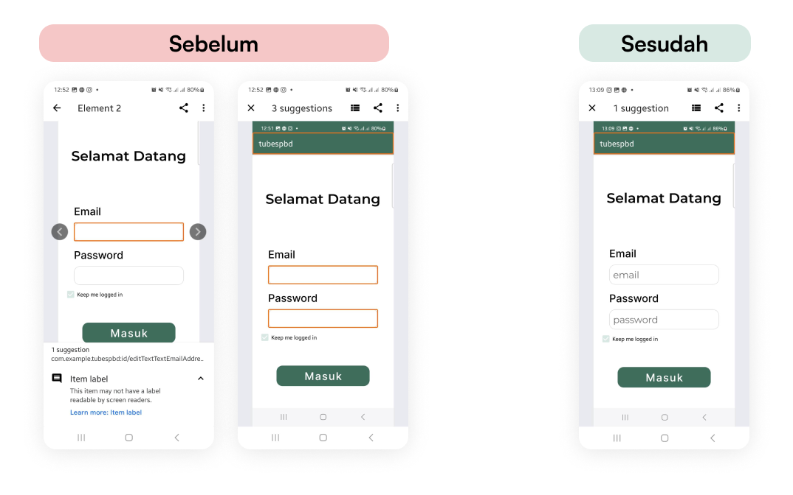
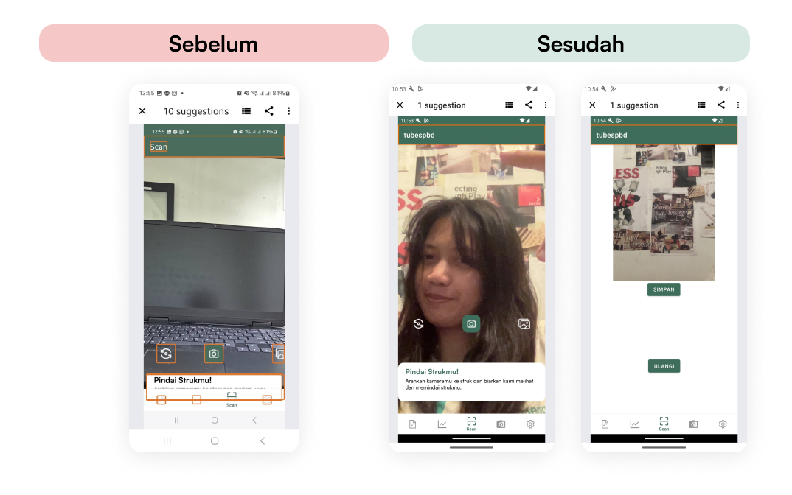
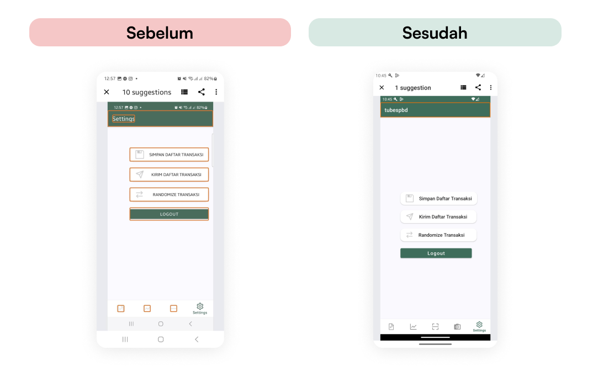
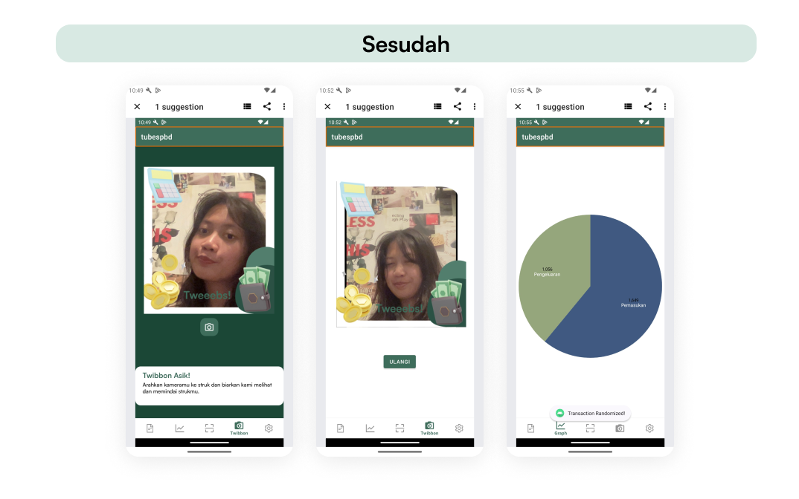
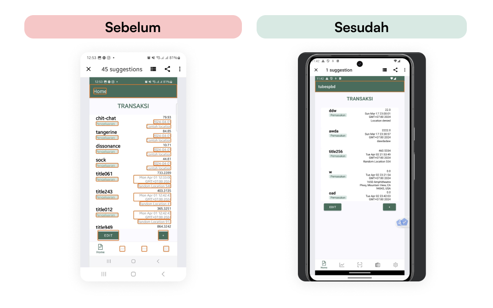
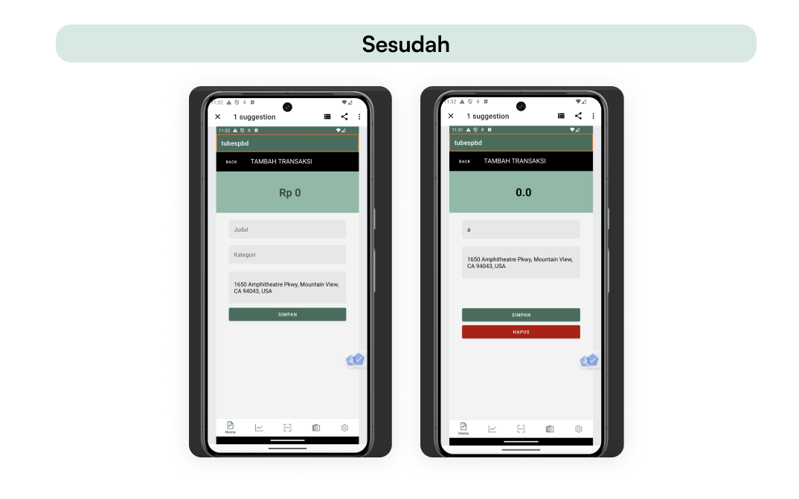

# IF3210-2024-Android-AVK

## BondoMan Android Application

BondoMan is an Android application that provides a comprehensive solution for users to manage and recap their financial transactions. Built with Kotlin, it offers a range of features designed to create, track, and analyze personal or business transactions.

`Built for the fulfillment of IF3210 Platform-Based Development Project 1`

## Features
- **User Authentication**: Secure login system with JWT authentication to protect user data. 
- **Interactive Dashboard**: Navigate through different features like Transaction Menu, Scan Menu, Graph Menu, and Settings Menu with visual cues on the navbar for active menu items. 
- **Transaction Management**: Add, edit, and delete transaction records with attributes such as title, category (Income, Expenditure), amount, and location. 
- **Transaction History**: Offline-accessible transaction history using Room Database implementing the Repository Pattern. 
- **Google Maps Integration**: Interactive map display for transaction locations, allowing users to open locations directly in Google Maps. 
- **Scan Receipts**: Digitize transaction details by scanning receipts, with options to retake scans or save them to the transaction list. 
- **Graphical Summary**: Visualize transaction summaries through graphs, with support for both portrait and landscape orientations. 
- **Export Transactions**: Save transaction lists as .xlsx or .xls files for external use and archiving. 
- **Email Integration**: Send transaction lists via GMail, attaching the spreadsheet as a file. 
- **JWT Expiry Check**: Background service to check for JWT expiry, with automatic logout or re-login as defined behavior. 
- **Network Sensing**: Detect internet connectivity and prompt users when offline, ensuring the app remains functional without an active connection. 
- **Randomize Transaction Feature**: A special function in the Settings Menu to add randomized transactions to the list.
- **Twibbon**: A special scanning feature that integrates a twibbon image into the captured image.

## Getting Started

### Prerequisites
Ensure you have Android Studio installed to build and run the application. You'll also need an Android device or emulator with at least Android API level 29.

### Installing To set up the project on your local machine
1. Clone the repository: ```bash git clone https://github.com/yourusername/transaction-recap-app.git```
2. Open the project in Android Studio.
3. Build the project and run it on your Android device or emulator.

### Usage
After logging in, you will be presented with a dashboard containing all features. Navigate using the navbar to add transactions, view summaries, or adjust settings.

# OWASP

### M4: Insufficient Input/Output Validation

Insufficient input validation is a security risk where an application fails to properly validate input coming from outside the application (like user input, files, network inputs, etc.). This can lead to various security vulnerabilities, including SQL injection, cross-site scripting (XSS), and buffer overflows, which attackers can exploit to manipulate the system.

In the context of mobile apps, insufficient input validation could allow malicious input to affect the backend server or other parts of the application. It could also result in improper output being displayed to the user, potentially leading to information leakage.

### M8: Security Misconfiguration

Security misconfiguration happens when an application is not securely configured, or when secure settings are not defined, implemented, and maintained as defaults. This can happen at any level of an application stack, including the network, platform, web server, application server, database, and application itself.

In mobile apps, this might involve misconfiguring security headers, having unnecessary services running on the device, or failing to properly configure and patch issues promptly.

### M9: Insecure Data Storage

Insecure data storage refers to vulnerabilities where sensitive data is not securely stored, potentially leading to unauthorized access and data breaches. In mobile applications, this often relates to storing sensitive information unencrypted on the device's persistent storage (like using SharedPreferences in Android without proper encryption).

The risk is that if a device is compromised, an attacker could easily access and extract sensitive data, such as personal details, credentials, or financial information.

### Analysis

Analysis from the OWASP for BondoMan Application
1. M4: Insufficient Input/Output Validation
	1. Login page - email validation, and credentials validation
	2. Transactions edit and create - type validation
	3. [Tambahin lagi]
2. M8: Security Misconfiguration
	1. Token Expiration Service - Time-based expiration checking, using token bearer
	2. Login Service - Service to handle login logic
	3. Bill Service - Uploading Bills into the backend server
	4. Network Service - Service to handle network configuration
3. M9: Insecure Data Storage
	1. Using Encrypted Shared Preferences to store sensitive data like tokens and authorization so that other users can't easily access


## Accessibility Testing
Semua halaman pada program telah dicek accessibility-nya. File screenshot dapat diperoleh pada folder accessibility-testing.

### Login Page


Perbaikan yang sudah dilakukan adalah input field yang diberikan hint, menjadi lebih besar, dan juga tidak fixed-height.

### Scan Page


Perbaikan yang dilakukan adalah memperbaiki icon supaya terdapat label dan memperbaiki lokasi button yang tidak konsisten. Selain itu, navbar juga diubah sehingga lebih terlihat.

### Settings Page


Perbaikan yang dilakukan adalah memperbaiki posisi button dan memperjelas tulisan pada button. Selain itu, button tidak lagi memiliki fixed width.

### Twibbon and Graph Page


Tidak ada masalah dalam page ini.

### Transaction History Page


Terdapat beberapa pembaruan pada page transaksi seperti pengaturan warna setiap instance dari history transaksi menjadi lebih contrast, membuat tombol dengan ukuran lebih besar agar dapat di klik, serta membuat ukuran component dinamis agar dapat disesuaikan dengan ukuran text.

### Transaction Page


### Made by

| NIM      | Name            | Features                                                                     |
| -------- | --------------- | ---------------------------------------------------------------------------- |
| 13521089 | Kenneth Ezekiel | Login, Logout, JWT Expiration, Network Sensing, Broadcast Receiver           |
| 13521151 | Vanessa Rebecca | Header navbar, CRUD Transactions and Repository, View Transactions                          |
| 13521171 | Alisha Listya   | Scan bill, Transactions graph, Settings, Save and send transactions, Twibbon |
